# Chapter 6: System Design

## 6.1 System Architecture

The TravelEase application follows a **three-tier client-server architecture**. The presentation tier handles all user-facing interaction through HTML, CSS, and JavaScript rendered via Jinja2 templates. The application tier processes business logic through Flask route handlers. The data tier manages persistent storage through SQLAlchemy ORM connected to MySQL (with automatic SQLite fallback).

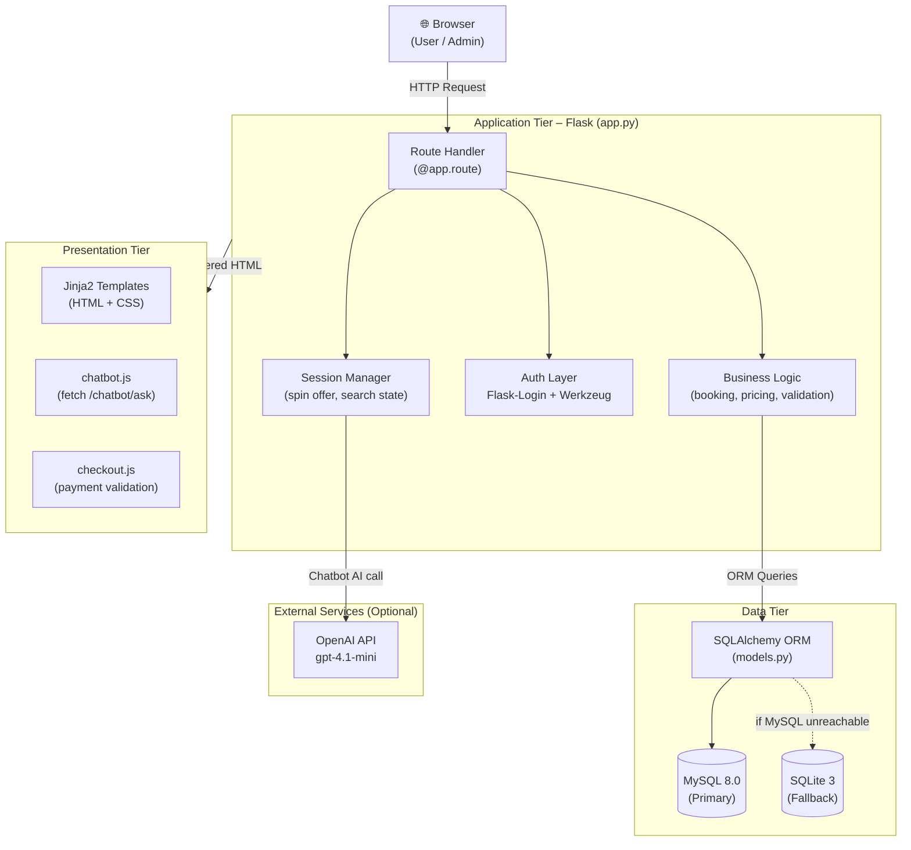

---

## 6.2 Database Design

The database contains **14 tables** mapped to SQLAlchemy model classes in `models.py`. All foreign key relationships enforce referential integrity.

### Table 1 – Database Entity Description

| Table Name | Primary Key | Foreign Keys | Description |
|---|---|---|---|
| `users` | `id` | — | Registered user accounts with hashed passwords and admin flag |
| `packages` | `id` | — | Holiday packages with price, duration, itinerary, hotel, images |
| `bookings` | `id` | `user_id → users`, `package_id → packages` | Package booking records with status, members, and total price |
| `flights` | `id` | — | Flight routes with airline, flight number, cities, and base price |
| `flight_bookings` | `id` | `flight_id → flights`, `user_id → users` | Flight booking records with date, class, travellers, final price |
| `trains` | `id` | — | Train routes with operator, train number, cities, and base price |
| `train_bookings` | `id` | `train_id → trains`, `user_id → users` | Train booking records with date, class, travellers, final price |
| `buses` | `id` | — | Bus routes with operator, bus number, cities, and base price |
| `bus_bookings` | `id` | `bus_id → buses`, `user_id → users` | Bus booking records with date, class, travellers, final price |
| `cabs` | `id` | — | Cab records with provider, cab type, route, and base price |
| `cab_bookings` | `id` | `cab_id → cabs`, `user_id → users` | Cab booking records with date, class, travellers, final price |
| `reviews` | `id` | `user_id → users`, `package_id → packages` | Star ratings (1–5) and text comments per user per package |
| `wishlist` | `id` | `user_id → users`, `package_id → packages` | Saved package associations per user |
| `contact_us` | `id` | — | Customer support inquiries with status tracking |

---

## 6.3 Data Flow Diagram

### DFD Level 0 – Context Diagram

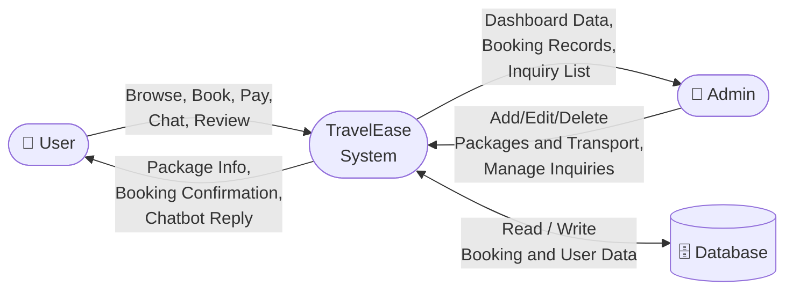

---

### DFD Level 1 – Major Processes

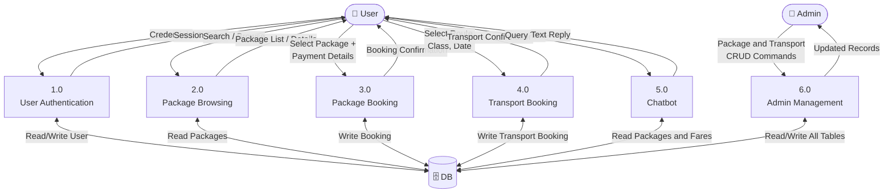

---

### DFD Level 2 – Package Booking Flow

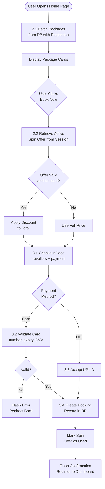

---

## 6.4 Entity-Relationship (ER) Diagram

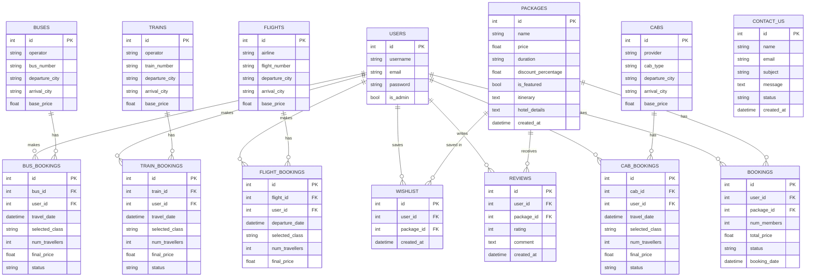

---

## 6.5 Flowcharts

### Flowchart 1 – User Registration and Login

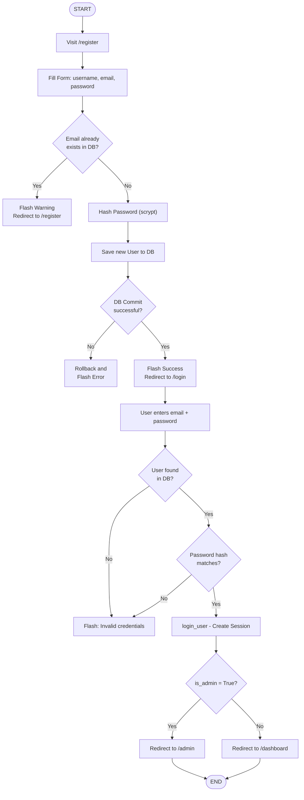

---

### Flowchart 2 – Package Booking and Payment

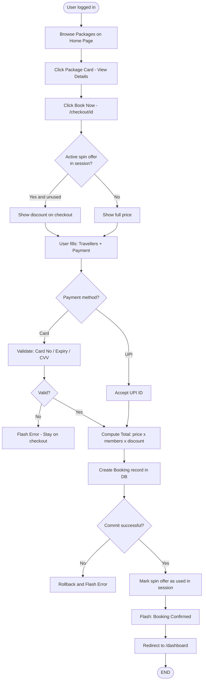

---

### Flowchart 3 – Chatbot Response Strategy

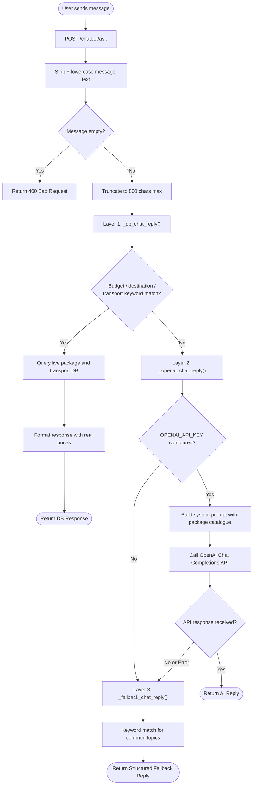

---

### Flowchart 4 – Admin Operations

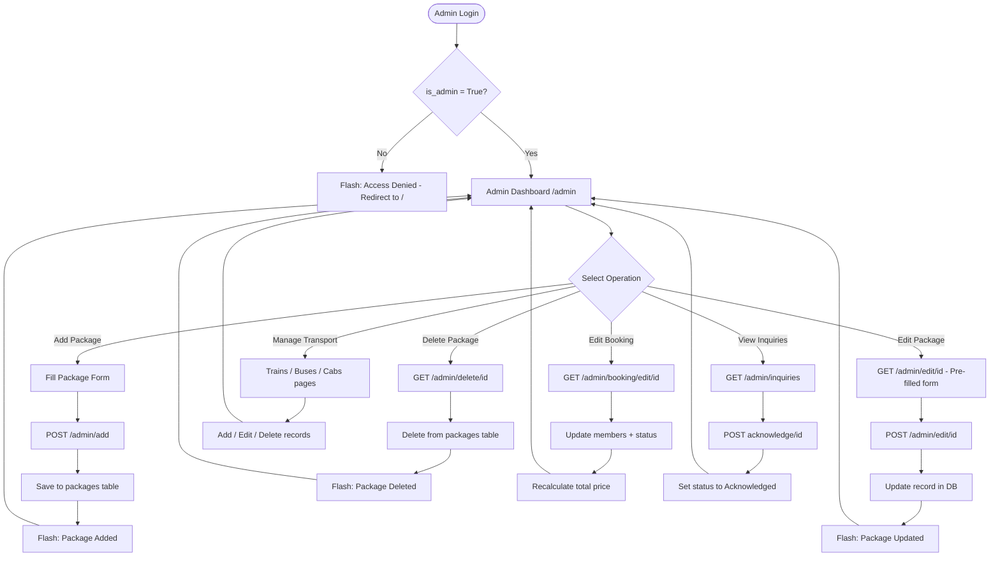

---

## 6.6 Use Case Diagrams

### Use Case Diagram – Regular User

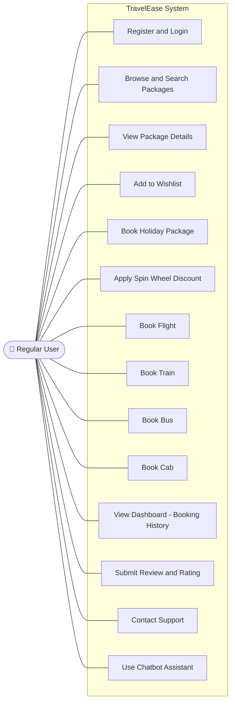

---

### Use Case Diagram – Admin

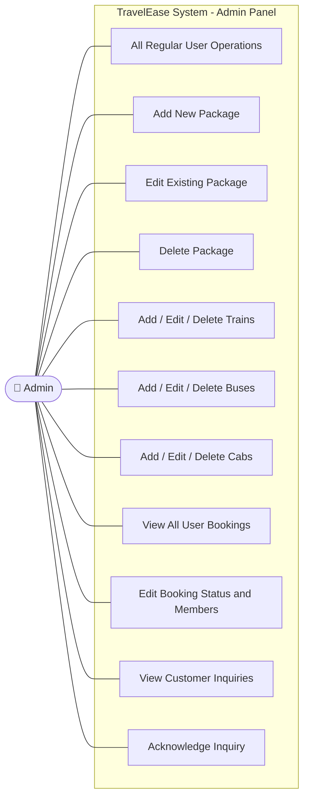

---

## 6.7 Module Description

### Table 2 – Module Description Summary

| # | Module | Functionality | Key Routes | DB Tables Used |
|---|---|---|---|---|
| 1 | **User Authentication** | Registration, login, logout, session creation, password hashing | `/register`, `/login`, `/logout` | `users` |
| 2 | **Package Management** | Home listing with pagination, keyword/price search, detailed package view | `/`, `/search`, `/package/<id>` | `packages` |
| 3 | **Package Booking** | Checkout, spin discount, payment validation, booking creation | `/checkout/<id>`, `/pay` | `bookings`, `packages` |
| 4 | **Flight Booking** | Route listing, class/date selection, fare computation, booking | `/flights`, `/flight-checkout`, `/flight-pay` | `flights`, `flight_bookings` |
| 5 | **Train Booking** | Train listing, class selection, fare computation, booking | `/trains`, `/train-checkout`, `/train-pay` | `trains`, `train_bookings` |
| 6 | **Bus Booking** | Bus listing, class/date selection, fare computation, booking | `/buses`, `/bus-checkout`, `/bus-pay` | `buses`, `bus_bookings` |
| 7 | **Cab Booking** | Cab listing, provider/route selection, booking | `/cabs`, `/cab-checkout`, `/cab-pay` | `cabs`, `cab_bookings` |
| 8 | **User Dashboard** | Unified booking history — all 5 categories, each paginated | `/dashboard` | All booking tables |
| 9 | **Wishlist** | Add/remove packages, view saved packages | `/wishlist`, `/wishlist/add/<id>` | `wishlist`, `packages` |
| 10 | **Reviews** | Submit star rating (1–5) and comment; one review per user per package | `/package/<id>/review` | `reviews` |
| 11 | **Spin Wheel Offer** | Daily weighted-probability discount generation, session storage | `/offers/spin` | Session only |
| 12 | **Chatbot** | Layer 1: DB-aware intent; Layer 2: OpenAI API; Layer 3: fallback | `/chatbot/ask` | `packages`, transport tables |
| 13 | **Contact Support** | Inquiry submission, status tracking | `/contact` | `contact_us` |
| 14 | **Admin – Packages** | Full CRUD on holiday packages via web forms | `/admin/add`, `/admin/edit/<id>`, `/admin/delete/<id>` | `packages` |
| 15 | **Admin – Transport** | Add, edit, delete train, bus, and cab records | `/admin/trains`, `/admin/buses`, `/admin/cabs` | `trains`, `buses`, `cabs` |
| 16 | **Admin – Bookings** | View all user bookings, update member count and status | `/admin`, `/admin/booking/edit/<id>` | `bookings` |
| 17 | **Admin – Inquiries** | View contact inquiries, mark as acknowledged | `/admin/inquiries` | `contact_us` |

---

### Table 3 – Transport Class Multiplier Table

| Travel Class | Category | Price Multiplier | Example (Base ₹2,000, 2 travellers) |
|---|---|---|---|
| Economy | Flights | 1.0× | ₹2,000 × 1.0 × 2 = **₹4,000** |
| Premium | Flights | 1.4× | ₹2,000 × 1.4 × 2 = **₹5,600** |
| Business | Flights | 2.2× | ₹2,000 × 2.2 × 2 = **₹8,800** |
| Standard | Trains / Buses | 1.0× | ₹800 × 1.0 × 2 = **₹1,600** |
| Comfort | Trains / Buses | 1.3× | ₹800 × 1.3 × 2 = **₹2,080** |
| Luxury | Cabs | 1.8× | ₹1,500 × 1.8 × 2 = **₹5,400** |

**Formula:** `final_price = base_price × class_multiplier × num_travellers`

---

### Table 4 – Spin Wheel Offer Probability Table

| Offer Label | Discount | Weight | Approximate Probability |
|---|---|---|---|
| 5% OFF | 5% | 24 | 24.0% |
| 10% OFF | 10% | 20 | 20.0% |
| Try Again | 0% | 18 | 18.0% |
| 12% OFF | 12% | 14 | 14.0% |
| 7% OFF | 7% | 10 | 10.0% |
| 20% OFF | 20% | 6 | 6.0% |
| No Offer | 0% | 5 | 5.0% |
| 15% OFF | 15% | 3 | 3.0% |
| **Total** | — | **100** | **100%** |

Higher-value discounts carry lower weights. The weighted selection uses `random.uniform(0, total_weight)` and iterates through offers accumulating weights until the roll is exceeded.

---

### Table 5 – Complete Flask API Endpoint Summary

| Method | Endpoint | Description | Auth | Admin |
|---|---|---|---|---|
| GET/POST | `/register` | User registration | No | No |
| GET/POST | `/login` | User login | No | No |
| GET | `/logout` | User logout | Yes | No |
| GET | `/` | Home — package listing with pagination | No | No |
| GET | `/search` | Package search with keyword and price filter | No | No |
| GET | `/package/<id>` | Package detail with reviews and wishlist status | No | No |
| POST | `/package/<id>/review` | Submit star rating and comment | Yes | No |
| GET | `/checkout/<id>` | Package checkout page with spin discount | Yes | No |
| POST | `/pay` | Confirm package booking and payment | Yes | No |
| GET | `/dashboard` | Unified user booking dashboard | Yes | No |
| POST | `/offers/spin` | Generate or retrieve daily spin-wheel offer | No | No |
| POST | `/chatbot/ask` | Chatbot query — DB / AI / fallback pipeline | No | No |
| GET | `/wishlist` | View saved wishlist packages | Yes | No |
| POST | `/wishlist/add/<id>` | Add package to wishlist | Yes | No |
| POST | `/wishlist/remove/<id>` | Remove package from wishlist | Yes | No |
| GET/POST | `/contact` | Contact support inquiry form | No | No |
| GET | `/flights` | Browse available flights | No | No |
| POST | `/flights/book` | Initiate flight booking (store in session) | Yes | No |
| GET | `/flight-checkout` | Flight checkout page | Yes | No |
| POST | `/flight-pay` | Confirm flight booking | Yes | No |
| GET | `/trains` | Browse available trains | No | No |
| POST | `/train/book` | Initiate train booking | Yes | No |
| GET | `/train-checkout` | Train checkout page | Yes | No |
| POST | `/train-pay` | Confirm train booking | Yes | No |
| GET | `/buses` | Browse available buses | No | No |
| POST | `/bus/book` | Initiate bus booking | Yes | No |
| GET | `/bus-checkout` | Bus checkout page | Yes | No |
| POST | `/bus-pay` | Confirm bus booking | Yes | No |
| GET | `/cabs` | Browse available cabs | No | No |
| POST | `/cab/book` | Initiate cab booking | Yes | No |
| GET | `/cab-checkout` | Cab checkout page | Yes | No |
| POST | `/cab-pay` | Confirm cab booking | Yes | No |
| GET | `/admin` | Admin dashboard overview | Yes | Yes |
| POST | `/admin/add` | Add new package | Yes | Yes |
| GET/POST | `/admin/edit/<id>` | Edit existing package | Yes | Yes |
| GET | `/admin/delete/<id>` | Delete package | Yes | Yes |
| GET/POST | `/admin/booking/edit/<id>` | Edit booking status and member count | Yes | Yes |
| GET | `/admin/inquiries` | View all support inquiries | Yes | Yes |
| POST | `/admin/inquiries/acknowledge/<id>` | Mark inquiry as acknowledged | Yes | Yes |
| GET | `/admin/trains` | List all train records | Yes | Yes |
| POST | `/admin/trains/add` | Add new train record | Yes | Yes |
| GET/POST | `/admin/trains/edit/<id>` | Edit train record | Yes | Yes |
| POST | `/admin/trains/delete/<id>` | Delete train record | Yes | Yes |
| GET | `/admin/buses` | List all bus records | Yes | Yes |
| POST | `/admin/buses/add` | Add new bus record | Yes | Yes |
| GET/POST | `/admin/buses/edit/<id>` | Edit bus record | Yes | Yes |
| POST | `/admin/buses/delete/<id>` | Delete bus record | Yes | Yes |
| GET | `/admin/cabs` | List all cab records | Yes | Yes |
| POST | `/admin/cabs/add` | Add new cab record | Yes | Yes |
| GET/POST | `/admin/cabs/edit/<id>` | Edit cab record | Yes | Yes |
| POST | `/admin/cabs/delete/<id>` | Delete cab record | Yes | Yes |
