# Holiday Booking System - Synopsis II

## 1. Introduction
This document presents the second synopsis of the Holiday Booking System. The first synopsis introduced the idea and basic design. This second synopsis explains the complete working of the system in detail, including modules, data flow, database design, use cases, and progress status.

The project is a web-based booking platform where users can search travel options, book holiday packages, and reserve transport services. The platform also includes admin features for data management and support handling.

### 1.1 Need for the System
Travel planning usually requires users to visit many websites for packages, transport, reviews, and support. This creates confusion and increases effort. A single integrated system reduces this complexity and provides better booking control.

### 1.2 Core Idea
The core idea is to provide one portal where:
- users can register, explore, compare, and book
- admins can manage package and transport data
- booking records remain organized in one database
- communication is supported through contact and chatbot modules

## 2. Problem Statement
Existing travel booking practices face several practical issues:
- package and transport data are spread across different platforms
- price comparison is not always easy for users
- manual handling of bookings causes delay and record mismatch
- support requests are not tracked in a structured way
- administrators do not always have centralized operational control

The system addresses these issues through a role-based and database-driven online application.

### 2.1 Detailed Problem Analysis
In many travel scenarios, users first search destinations on one site, compare prices on another, and then separately book transport. This fragmented process creates repeated data entry, inconsistent fare comparison, and a high chance of missing important details such as timing, duration, and total cost.

For administrators, the problem is different but equally important. If package records, booking records, and inquiry records are handled in separate tools, decision-making becomes slow and error-prone. A unified system solves this by storing all operational information in one structured data model.

## 3. Proposed Solution
The proposed solution is a Flask-based holiday booking web application with complete user and admin flows.

### 3.1 User Side Features
- account registration and login
- package listing with detailed package pages
- package booking and payment simulation
- transport booking (flight, train, bus, cab)
- wishlist and review management
- contact form for support
- dashboard to view booking history

### 3.2 Admin Side Features
- admin login and protected dashboard
- package add and delete operations
- transport master data management for train, bus, and cab (add/edit/delete)
- booking edit controls for package bookings
- inquiry review and acknowledgment

### 3.3 Support Features
- search with text, price filter, and sorting
- chatbot response handling with database-aware logic, AI attempt, and fallback path

### 3.4 Practical Working Approach
The solution is implemented as modular route groups in the backend. Each module has clear responsibilities:
- authentication routes manage account and session state
- package routes manage browsing, details, and booking
- transport routes manage availability and booking for each mode
- admin routes manage operational data and user support records

This separation improves maintainability. It also makes future extension easier, because each module can be enhanced without changing the full system.

## 4. Objectives
- Build a complete travel booking workflow in one system.
- Reduce user effort in searching and booking.
- Maintain structured and reliable data records.
- Provide admin control for operational tasks.
- Improve user trust with review and wishlist functionality.
- Create a base architecture that supports future production features.

### 4.1 Expected Outcomes
- Users should be able to complete booking in fewer steps compared to manual workflow.
- Admins should be able to maintain package and transport records from one dashboard flow.
- The system should preserve historical booking and support records for later analysis.
- The architecture should remain stable when advanced features are added.

## 5. Scope of System
### 5.1 In Scope
- user authentication and session handling
- package browsing, details, and booking
- flight/train/bus/cab booking flows
- search, sort, and price filtering
- wishlist, reviews, and contact support
- admin dashboard and data management
- database-backed workflow for all major modules

### 5.2 Out of Scope (Current Build)
- live payment gateway integration
- cancellation and refund engine
- advanced reporting and analytics dashboard
- email or SMS notification services

### 5.3 Stakeholders
- End Users: individuals booking packages and transport.
- Admin Users: operators managing package/transport records and inquiries.
- Project Team: developers and evaluators using the project for implementation and academic assessment.

## 6. Feasibility and Requirement Overview
### 6.1 Technical Feasibility
The system is technically feasible with standard web technologies:
- Python Flask for server-side logic
- SQLAlchemy for ORM and database interaction
- MySQL as primary DB with SQLite fallback support
- HTML/CSS/JavaScript templates for UI screens

### 6.2 Operational Feasibility
The interface follows clear pages and step-by-step booking forms. Users and admins can perform actions without complex training.

### 6.3 Economic Feasibility
The project uses open-source tools and local hosting, so development cost remains low for academic deployment.

### 6.4 Basic Software Requirements
- Python 3.x
- Flask, Flask-Login, SQLAlchemy
- Browser for user/admin access
- MySQL server (optional if SQLite fallback is used)

### 6.5 Hardware and Runtime Environment
- Minimum: dual-core processor, 4 GB RAM, local storage for database.
- Recommended: 8 GB RAM for smooth development and testing.
- Runtime: local host deployment using Flask development server.

## 7. Technology Stack
- Backend: Python, Flask
- Database Layer: SQLAlchemy ORM
- Databases: MySQL (primary), SQLite fallback
- Frontend: HTML, CSS, JavaScript, Jinja templates
- Security: password hashing, role-based admin checks, login-required route protection

### 7.1 Reason for Technology Selection
- Flask is lightweight and suitable for modular web applications.
- SQLAlchemy reduces direct SQL complexity and improves maintainability.
- MySQL is suitable for structured relational data with multiple linked tables.
- SQLite fallback allows uninterrupted local execution in environments where MySQL is not available.

## 8. System Architecture
The application follows a server-centered architecture. User and admin requests are processed by Flask routes. The backend communicates with database tables using ORM models. Payment is currently simulated inside application logic. Chatbot responses are generated through layered handling.

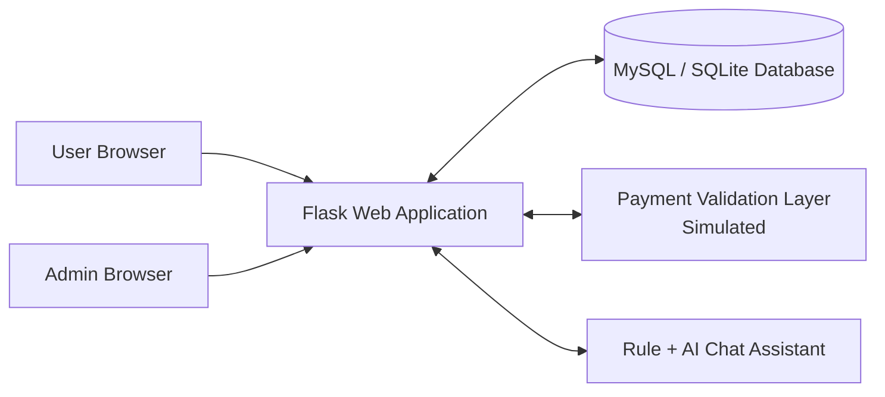

### 8.1 Architecture Explanation
- User and admin are external actors.
- Flask routes handle requests and form submissions.
- Database stores users, packages, bookings, and support data.
- Payment layer validates card input for simulated confirmation.
- Chatbot layer supports query guidance and package response.

### 8.2 Request Lifecycle in the System
1. user/admin sends HTTP request from browser
2. Flask route receives request and validates input
3. ORM layer queries or updates corresponding database table
4. business logic computes output (price, status, message)
5. response is rendered as HTML page or JSON reply

This lifecycle is common across most modules, which gives consistency in development and debugging.

## 9. Functional and Non-Functional Requirements
### 9.1 Functional Requirements
- FR1: System shall allow user registration and login.
- FR2: System shall display package and transport options.
- FR3: System shall support booking creation after payment validation.
- FR4: System shall store and display booking history in dashboard.
- FR5: System shall allow review and wishlist actions for logged-in users.
- FR6: System shall provide admin pages for data operations.
- FR7: System shall store and track contact inquiries.

### 9.2 Non-Functional Requirements
- NFR1: Pages should load quickly for normal query size.
- NFR2: Passwords should not be stored in plain text.
- NFR3: Access control should restrict admin routes.
- NFR4: Database records should remain consistent after operations.
- NFR5: System should support modular extension.

### 9.3 Requirement Traceability Snapshot
| Requirement ID | Implemented Through | Expected Result |
|---|---|---|
| FR1 | register/login routes + user model | authenticated access |
| FR2 | home/detail/search routes + package model | package visibility and filtering |
| FR3 | checkout/pay routes + booking model | booking confirmation after validation |
| FR4 | dashboard routes + booking query | booking history visibility |
| FR6 | admin routes + role check | protected admin control |
| NFR2 | password hashing logic | better credential safety |
| NFR3 | login required + admin check | unauthorized access prevention |

## 10. Module-Wise Description and Working

### 10.1 Authentication Module
Purpose: Manage user identity and secure access.

Input:
- username, email, password (registration)
- email, password (login)

Processing:
- duplicate email check
- password hashing
- session creation after successful login
- role check for admin redirection

Output:
- normal user redirected to user dashboard
- admin user redirected to admin dashboard
- validation messages for invalid login or duplicate email

### 10.2 Package Management Module
Purpose: Handle package display and package data operations.

User Side Working:
- package list is shown on home page
- package detail page shows itinerary, highlights, and review summary
- user can add package to wishlist and view reviews

Admin Side Working:
- admin can add package entries with major details
- admin can remove outdated package entries

### 10.3 Package Booking Module
Purpose: Convert selected package into confirmed booking.

Workflow:
1. user opens checkout page
2. user selects number of members
3. system calculates total package amount
4. user enters payment fields
5. booking record is stored after validation
6. dashboard displays confirmed booking

Validation:
- login is mandatory
- card number and CVV fields are required

### 10.4 Transport Booking Module
Purpose: Support standalone booking for flight, train, bus, and cab.

Common Steps:
1. user enters source, destination, date, class, and travellers
2. matching records are fetched from relevant table
3. fare is calculated using class multiplier and traveller count
4. user proceeds to checkout and confirms payment
5. booking is stored in transport-specific booking table

Price Calculation:
- per_person = base_price x class_multiplier
- total = per_person x travellers

### 10.5 Search and Filter Module
Purpose: Improve package discovery.

Supported Operations:
- text search by package name/description
- minimum and maximum price filter
- sorting by newest, low price, high price

Result:
- users can quickly compare packages by budget and relevance

### 10.6 Review and Wishlist Module
Purpose: Improve decision support and user engagement.

Working:
- user can submit rating and comment for package
- one review per user per package is enforced
- user can add/remove package from wishlist
- wishlist page shows saved package references

### 10.7 Contact and Inquiry Module
Purpose: Manage user support communication.

Working:
- user submits name, email, subject, and message
- entry is stored in contact table with default pending status
- admin views inquiry list and marks inquiries acknowledged

### 10.8 Admin Operations Module
Purpose: Provide centralized management control.

Features:
- view package and booking records
- edit package booking status and member count
- manage train, bus, and cab master records
- monitor and handle contact inquiries

### 10.9 Chatbot Module
Purpose: Provide quick assistant responses for travel questions.

Response Order:
1. database-aware response for package and budget queries
2. AI response attempt
3. fallback response if AI is unavailable

Benefit:
- users receive immediate guidance for common booking questions

### 10.10 Module Integration Mapping
| Module | Major Operations | Main Data Tables | Primary Output |
|---|---|---|---|
| Authentication | register, login, logout | users | session and role-based redirect |
| Package Management | list, details, admin add/delete | packages | package catalog and detail pages |
| Package Booking | checkout, payment, save booking | bookings, packages, users | confirmed package booking |
| Transport Booking | search, checkout, payment | flights/trains/buses/cabs and booking tables | confirmed transport booking |
| Review/Wishlist | add review, add/remove wishlist | reviews, wishlist | user feedback and saved list |
| Contact/Inquiry | submit inquiry, acknowledge | contact_us | support request tracking |
| Chatbot | DB-aware response, AI fallback | packages | query response guidance |

### 10.11 Business Rules Applied in Modules
- One email should map to one user account.
- One user can submit only one review per package.
- Booking creation requires successful payment-field validation.
- Admin operations require authenticated admin role.
- Transport fares are class-based and traveller-count dependent.

## 11. Detailed Literature Overview
The literature overview studies common practices in booking systems and compares them with this project design.

| Study Area | Common Approach in Existing Systems | Limitation Seen | Application in This Project |
|---|---|---|---|
| Web-based travel booking | Portal-based booking with user profiles | Users jump across different tools for package and transport | Combined package + transport booking in one system |
| Search and filtering | Basic keyword search and sorting | Weak multi-criteria filtering in simple portals | Text, price range, and sort options added |
| Booking workflow design | Multi-step checkout with validation | Poor validation causes failed or duplicate submissions | Validation checks before booking confirmation |
| Review and trust layer | Rating and comments help decision making | Duplicate or low-quality reviews affect credibility | Single user review per package rule |
| Wishlist behavior | Shortlisting before payment increases conversion | Missing persistent wishlist in simple portals | Account-linked wishlist storage |
| Admin control panels | CRUD dashboards for listings and records | Delayed update cycles due scattered tools | Unified admin operations dashboard |
| Payment integration | Gateway-based transaction confirmation | API integration complexity in academic builds | Simulated payment with extension-ready design |
| Support automation | FAQ bots and assisted chat | Generic response quality can be low | DB-aware + AI + fallback layered chatbot |

### 11.1 Literature Summary
Most systems solve only part of the travel journey. This project combines search, package booking, transport booking, support, and admin management in one structured application.

### 11.2 Research Gap Addressed by This Project
The major gap observed in many basic academic implementations is missing integration between package booking and transport booking. This project addresses that gap by maintaining separate transport entities while still giving the user a single platform experience. It also adds user support and operational controls that are often skipped in small prototypes.

## 12. Data Flow Diagram (DFD)
DFD explains how data enters the system, how it is processed, and where it is stored.

### 12.1 DFD Level 0 (Context Diagram)
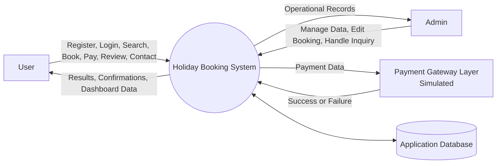

Explanation:
- The system interacts with User, Admin, Payment Layer, and Database.
- All core operations are handled by the central Holiday Booking System process.

### 12.2 DFD Level 1 (Major Processes)
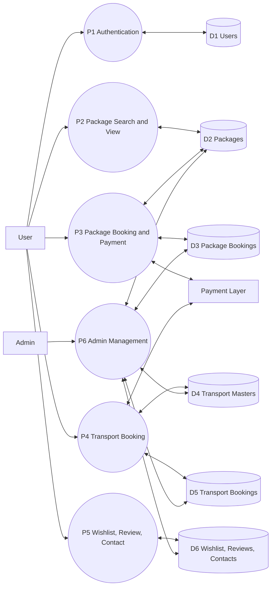

Explanation:
- Each major process has dedicated input and output data stores.
- Payment layer is shared by package and transport booking modules.

### 12.3 DFD Level 2 (Package Booking Process)
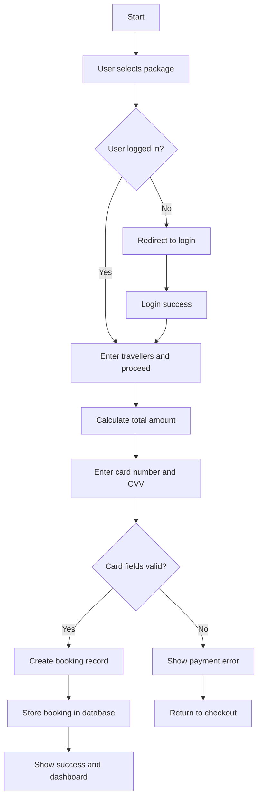

Explanation:
- This level shows detailed control flow for one core process: package booking.
- It includes authentication condition, validation, transaction record creation, and user feedback.

### 12.4 DFD Interpretation by Data Store
- D1 Users: stores identity and role details used by authentication and access control.
- D2 Packages: stores package catalog used in listing, detail, and search views.
- D3 Package Bookings: stores transaction records for package checkout.
- D4 Transport Masters: stores base records for flights, trains, buses, and cabs.
- D5 Transport Bookings: stores bookings created from transport checkout flows.
- D6 Reviews/Wishlist/Contacts: stores user interaction and support-related data.

## 13. Entity Relationship (ER) Diagram - Detailed
The ER model shows how tables are connected and how relationships support booking operations.

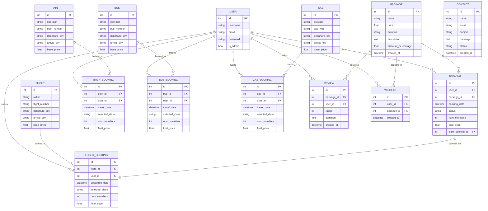

### 13.1 ER Explanation
- USER is central for identity and booking ownership.
- PACKAGE is linked to bookings, reviews, and wishlist entries.
- Transport entities are separated from transport booking entities for normalization.
- CONTACT table supports support lifecycle tracking.

### 13.2 Key Relationship Constraints
- `users.id` is referenced in all booking and interaction tables to maintain ownership.
- `packages.id` is referenced by bookings, reviews, and wishlist for consistency.
- transport booking tables reference both transport master table and user table.
- optional link from package booking to flight booking supports extensible design.
- all foreign key relationships protect referential integrity and reduce orphan records.

## 14. Use Case Diagram
Use case model describes system actions from actor perspective.

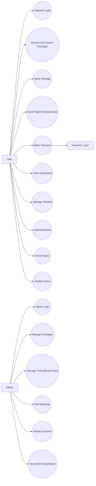

### 14.1 Use Case Explanation
- User actor covers browsing, booking, support, and feedback actions.
- Admin actor covers management and monitoring actions.
- Payment layer is linked to booking completion.

### 14.2 Detailed Use Case Narratives
#### UC-1 User Books a Holiday Package
Precondition: user is registered and logged in.  
Main Flow: user opens package details, proceeds to checkout, enters member count and payment details, receives confirmation.  
Postcondition: booking record is stored and visible in dashboard.

#### UC-2 User Books Transport
Precondition: transport records are available.  
Main Flow: user searches by route/date/class, selects option, confirms payment, receives booking confirmation.  
Postcondition: transport booking record is stored in corresponding booking table.

#### UC-3 Admin Handles Inquiry
Precondition: admin login success.  
Main Flow: admin opens inquiry list, reviews message, updates inquiry status to acknowledged.  
Postcondition: inquiry status reflects latest handling state.

## 15. Flowcharts
Flowcharts explain step-by-step logic for important system activities.

### 15.1 User Registration and Login Flow
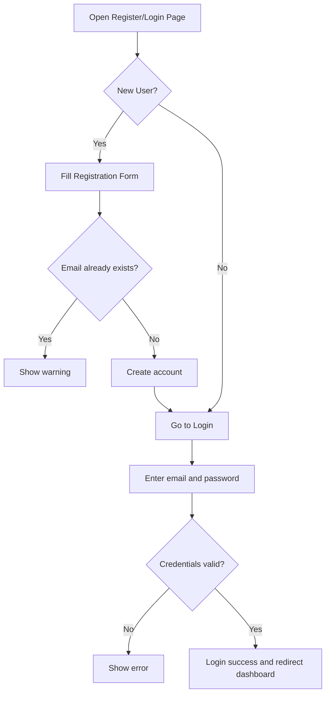

Explanation:
- This flow ensures account uniqueness and secure authentication.

### 15.2 Package Booking and Payment Flow
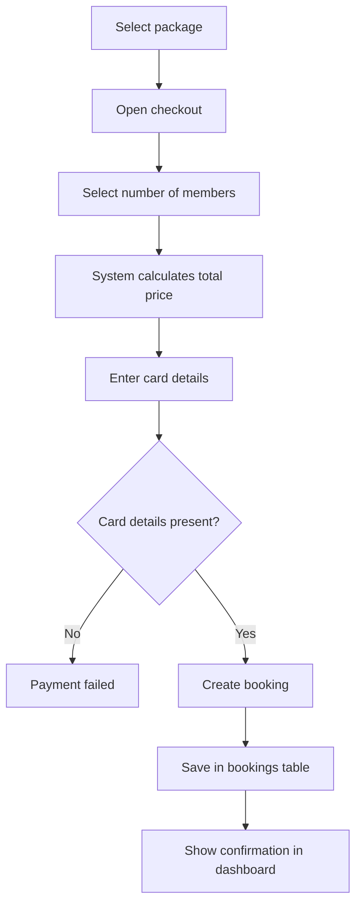

Explanation:
- Core booking flow includes validation, database storage, and confirmation.

### 15.3 Transport Booking Flow (Flight/Train/Bus/Cab)
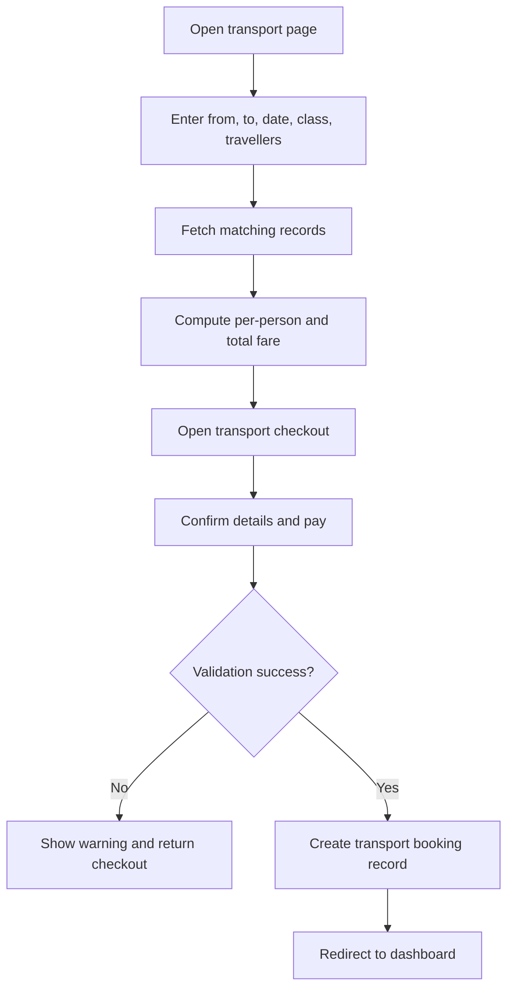

Explanation:
- Same structure is reused for flight, train, bus, and cab flows for consistency.

### 15.4 Admin Data Management Flow
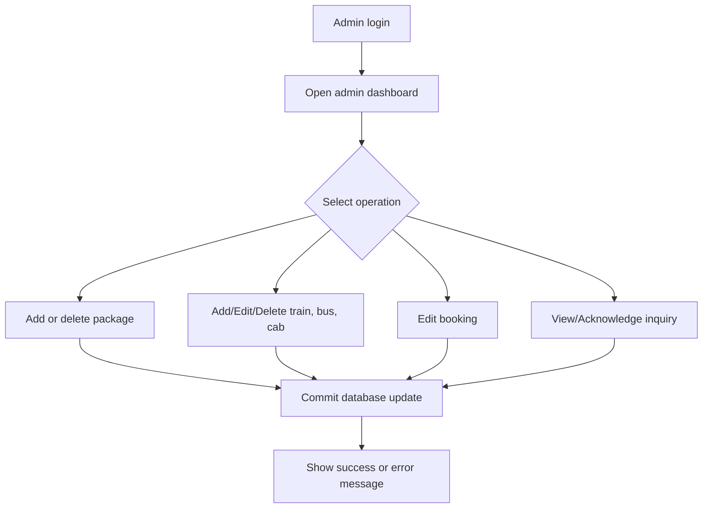

Explanation:
- Admin flow centralizes operational updates and status control.

### 15.5 Chatbot Response Flow
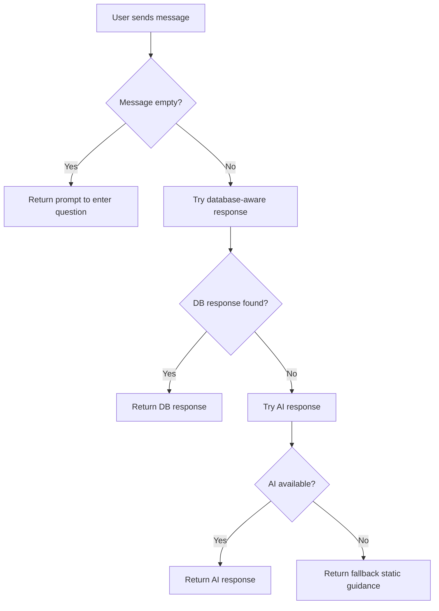

Explanation:
- Layered chatbot handling gives stable responses even if AI is not reachable.

### 15.6 Combined Flow Interpretation
All flowcharts follow a common design pattern:
- input collection from user/admin
- validation and decision branch
- transaction or state update in database
- output response as confirmation, warning, or redirection

This common pattern improves consistency and lowers implementation complexity.

## 16. Module Description with Screenshots
Use the following screenshot slots in the report. Each image should include a clear caption and figure number.

| Screenshot ID | Module | Screen to Capture | Route/Page |
|---|---|---|---|
| SS-01 | Home and Package Listing | Main page with package cards | `/` (`index.html`) |
| SS-02 | Package Detail | Package detail with review section | `/package/<id>` |
| SS-03 | Authentication | Login and Register screens | `/login`, `/register` |
| SS-04 | Package Checkout | Package checkout with payment form | `/checkout/<id>` |
| SS-05 | User Dashboard | Bookings list after successful payment | `/dashboard` |
| SS-06 | Search Module | Search/filter/sort result page | `/search` |
| SS-07 | Transport Search | Flights/Trains/Buses/Cabs pages | `/flights`, `/trains`, `/buses`, `/cabs` |
| SS-08 | Transport Checkout | Example train/bus/cab/flight checkout | `/trains/checkout/<id>` etc. |
| SS-09 | Wishlist and Reviews | Wishlist page and review submission | `/wishlist`, package detail review form |
| SS-10 | Contact and Inquiry | Contact form and admin inquiry list | `/contact`, `/admin/inquiries` |
| SS-11 | Admin Dashboard | Admin summary with package and booking data | `/admin` |
| SS-12 | Admin Transport Management | Train/bus/cab CRUD screens | `/admin/trains`, `/admin/buses`, `/admin/cabs` |
| SS-13 | Chatbot | Chatbot query and response panel | Frontend chatbot widget |

### 16.1 Screenshot Presentation Guidelines
- keep browser zoom consistent for all screenshots
- capture full section relevant to the module (not cropped action only)
- add caption format: `Figure X.Y: <Screen Name>`
- place screenshot immediately after corresponding module explanation
- highlight important UI areas using subtle border or annotation if needed

## 17. Overall Progress of the Project

### 17.1 Completed Work
- Core authentication and user session management
- package listing, package details, and checkout flow
- package booking and dashboard history
- separate transport booking modules for flight/train/bus/cab
- search, filtering, and sorting for packages
- wishlist, review, and contact modules
- admin dashboard and transport management for train/bus/cab
- chatbot with database-aware and fallback responses

### 17.2 Partially Completed Work
- payment flow is simulated, not connected to live gateway API
- admin-side flight management workflow can be expanded
- testing coverage can be increased with more automated cases

### 17.3 Pending or Future Work
- real payment gateway integration with callback handling
- booking cancellation and refund processing
- reporting and analytics module for admin decisions
- notifications via email or SMS
- recommendation engine using user behavior data

### 17.4 Status Summary
- Functional completion: high for core workflows
- Data model maturity: strong for current scope
- Extension readiness: high due modular route and model design

### 17.5 Milestone-Wise Progress View
| Milestone | Major Deliverables | Current Status |
|---|---|---|
| M1 | requirement analysis and basic architecture | completed |
| M2 | authentication, package listing, and booking base | completed |
| M3 | transport modules and admin management | completed |
| M4 | review, wishlist, contact, chatbot support | completed |
| M5 | advanced testing and production integration items | in progress / future |

## 18. Testing Summary (Current)
### 18.1 Testing Done
- route-level checks for major user and admin pages
- booking flow checks for package and transport modules
- query validation checks for form-based workflows

### 18.2 Testing Gap
- no full end-to-end automation with browser tests yet
- no load testing and concurrency testing yet
- no full security penetration testing in current phase

### 18.3 Proposed Testing Plan
| Test Type | Target Module | Purpose |
|---|---|---|
| Unit Testing | price calculation, validation helpers | verify small logic units |
| Integration Testing | booking + payment + dashboard flow | verify module interaction |
| UI Testing | registration, checkout, admin forms | verify user-level behavior |
| Database Testing | FK integrity and CRUD behavior | verify data consistency |
| Security Testing | login/session/admin access | verify access control safety |

## 19. Risks and Mitigation
| Risk | Impact | Mitigation Strategy |
|---|---|---|
| Invalid user input | Incorrect records | Form validation and safe defaults |
| Unauthorized admin access | Data misuse | Role check and protected routes |
| Database unavailability | Booking interruption | SQLite fallback and retry-ready design |
| Payment integration errors (future) | Failed transactions | Layered payment module and error handling |

### 19.1 Risk Monitoring Approach
- maintain error logs for booking and admin operations
- review failed form submissions to improve validation rules
- track module-wise failure cases during testing cycles
- prioritize high-impact fixes in security and booking modules

## 20. Conclusion
The Holiday Booking System successfully demonstrates a complete academic booking platform with practical workflows. The project covers user journey, admin control, support handling, and relational database structure in a clear modular design. Core modules are working and integration-ready for advanced features such as real payments, cancellation, analytics, and notifications.

### 20.1 Final Synopsis Statement
This second synopsis demonstrates that the project is no longer at concept level. It now has clear module boundaries, practical workflows, defined data structure, and strong expansion scope. The current implementation is suitable for academic evaluation and can be upgraded to production-style behavior through planned future enhancements.

## 21. References (For Report Section)
- Flask Documentation
- SQLAlchemy Documentation
- Jinja2 Template Documentation
- OWASP Guidelines for Authentication and Session Handling
- Standard design references for DFD, ER, and Use Case modeling
